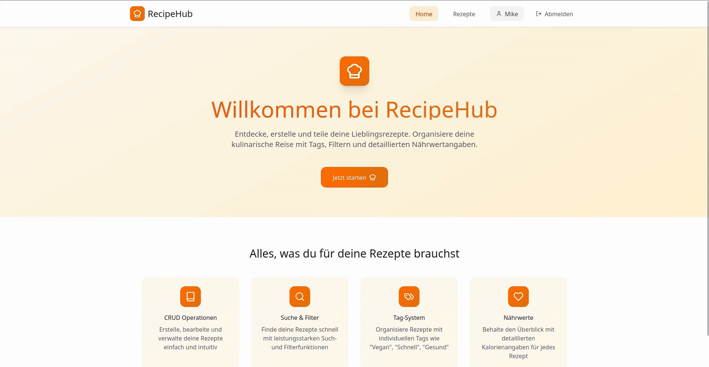

# RecipeHub

Eine moderne Rezept-App mit Vite-Frontend und Supabase-Backend. Nutzer können Rezepte erstellen, durchsuchen, filtern und als PDF exportieren. Die App unterstützt Accounts mit Login/Registrierung und eine strukturierte Verwaltung von Zutaten, Tags und Nährwerten.



---

## Tech Stack

### Frontend
- Vite
- JavaScript / TypeScript
- (optional) React
- HTML / CSS / TailwindCSS

### Backend
- Supabase
  - Auth (Login / Registrierung)
  - PostgreSQL Datenbank
  - Storage (Rezeptbilder)

---

## Features

### Authentifizierung
- Account erstellen (Registrierung)
- Login / Logout
- Geschützte Bereiche für eingeloggte Nutzer

### Rezepte
- Rezepte erstellen
- Rezepte löschen
- Rezepte bearbeiten
- Rezepte ansehen (Detailansicht)
- Rezepte filtern und durchsuchen
- Rezepte mit Tags kategorisieren

### Rezeptinhalt
Bei der Rezepterstellung können folgende Daten angegeben werden:
- Rezeptname
- Beschreibung des Rezepts
- Zutatenliste mit Mengenangaben
- Zubereitungsanleitung (Schritt für Schritt)
- Kalorienangabe
- Tags (z. B. vegan, schnell, dessert)
- Bild des Gerichts (Upload über Datei-Anhang)

### Suche & Filter
- Volltextsuche nach Rezeptnamen
- Filter nach Tags
- Kombinierbare Suche und Filter

### PDF-Export
- Rezepte können als PDF exportiert werden
- Enthält:
  - Rezeptname
  - Bild
  - Zutaten mit Mengen
  - Zubereitungsanleitung
  - Kalorienangabe

---

## Seiten / Pages

- Home
- Rezeptübersicht

---

## Datenbank-Struktur (vereinfacht)

### Tables

#### users
- id
- email

#### recipes
- id
- user_id
- title
- description
- instructions
- calories
- image_url
- created_at

#### ingredients
- id
- recipe_id
- name
- amount
- unit

#### tags
- id
- name

#### recipe_tags
- recipe_id
- tag_id

---

## Setup

### 1. Repository klonen
```bash
git clone https://github.com/mikeezvz/RecipeHub.git
cd RecipeHub
```

### 2. Abhängigkeiten installieren
```bash
npm install
```

### 3. Supabase konfigurieren
- Supabase Projekt erstellen
- Tabellen anlegen
- Storage Bucket für Rezeptbilder erstellen
- Umgebungsvariablen lokal definieren

```text
VITE_SUPABASE_URL=your_supabase_url
VITE_SUPABASE_ANON_KEY=your_anon_key
```

### 4. Entwicklungsserver starten
```bash
npm run dev
```

---

## Ziele des Projekts
- Saubere CRUD-Implementierung
- Praxisnaher Einsatz von Supabase Auth & Database
- Strukturierte Frontend-Architektur mit Vite
- Erweiterbar für Features wie Favoriten, Meal-Planning oder Community

---

## Mögliche Erweiterungen
- Favoriten-System
- Wochenplaner
- Kommentare & Bewertungen
- Nährwert-Detailansicht
- Dark Mode

---

## Lizenz
Dieses Projekt dient Lern- und Entwicklungszwecken.

